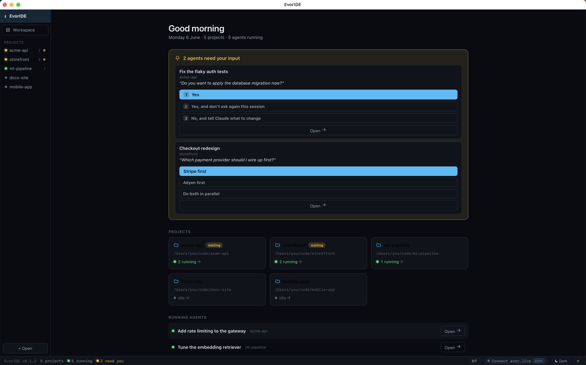

<div align="center">


# Evor

### Run many coding agents at once — and always know which one needs you.

An open, **agent-agnostic** desktop IDE for Claude Code, Codex, or any CLI agent. Watch and
steer every agent across every project from one window, jump straight to the one that's
blocked, and keep the **why** of your code next to the **what**.

> **Why:** real agentic work means several agents, several repos, and constantly losing
> track of which one is waiting on you. Evor makes that one glance.

**[⬇ Download](../../releases)** · **[📖 Docs & getting started](https://evor.dev)** · macOS · Windows · Linux

🆕 **New in [v0.1.9](https://github.com/EvorLive/evoride/releases/tag/v0.1.9): pause &amp; resume a whole project.** One button in the header tells every agent to save its progress, counts down, then interrupts them (Ctrl+C) and tears down services — `docker compose down` / `tilt down`, even stacks it detects running under a terminal. Hit ▶ Resume and it restarts the services and tells each agent to continue where it left off. Graceful shutdown → startup for your whole workspace.

> ⚠️ **Early / alpha.** Actively built in the open. Things move fast and break.
> Issues, ideas, and PRs are very welcome — this is meant to grow with its community.

<br />



<sub>The Home dashboard: which agents are <strong>waiting on you</strong> (with the actual question + one-click replies), what's running, and a daily recap — across every project.</sub>

</div>

---

## The idea

AI coding agents are getting great at writing code — but the tools around them are still
single-agent, single-project, and tied to one vendor. Real work means **several agents**
running at once, across **several repos**, and you constantly lose track of *what each one
is doing*, *which one needs you*, and *why* a change was made.

Evor is a bet on a different shape:

- **Agent-agnostic.** It's a terminal-first workspace. If your agent runs in a shell
  (`claude`, `codex`, `aider`, your own script…), Evor can host it. No lock-in.
- **Project-centric.** Each project collects its agents, run commands, git, and intent in
  one place. Switch projects from a rail that tells you which ones are *waiting for you*.
- **Intent-first.** The project's goals and decisions live *in the repo* (via
  [IntentFlow](https://github.com/rabin-a/intentflow)), credited to **who** wrote them and
  **which agent** was used — so the "why" survives.

If that resonates, [jump to Contributing](#contributing) — there's a lot to build.

---

## What's in this repo

A small monorepo of composable pieces. The IDE is the flagship; the rest stand alone too.

| Component | What it is | Stack |
|---|---|---|
| **`ide/`** — Evor | The multi-agent desktop IDE (the main app) | Tauri 2 · React · Vite |
| **`tui/`** — eterm | A "smart terminal": real pty shell + agent/error detection, opt-in cloud sync | Rust · ratatui |
| **`server/`** — relay | WebSocket relay to view/control terminal sessions remotely | Rust · Axum |
| **`web/`** — dashboard | Browser dashboard for live sessions (xterm.js) | Next.js |
| **`core/`** — eterm-core | Shared terminal hygiene + agent/error/prompt detection | Rust |
| **`shared/`** | Wire protocol shared by relay/TUI/dashboard | Rust |

---

## Evor features

Everything below works against **any** agent CLI — Claude Code and Codex are first-class,
and you can [add your own](#add-your-own-agent) in one file.

- 🗂 **Multi-project** — a left rail of your projects; a green dot for active ones and an
  amber **"waiting for input"** badge so you instantly see which agent needs a reply.
- 🤖 **Many agents at once** — spawn Shell / Claude / Codex / custom sessions per project;
  navigate between them; background agents keep running (Chrome-style tab discarding keeps
  it fast and restores context on return).
- ▶️ **Run / Stop** — detects how to run your project; **monorepo-aware** run config
  (`.evoride/run.json`) to start/stop individual services. **Autopilot setup** (an agent
  configures the run for you, hands-free), per-service **View console**, services reuse the
  same terminal across restarts, and an open-in-browser button when a dev server prints a URL.
- ⏸ **Pause / resume a project** *(new in v0.1.9)* — gracefully suspend everything in a
  project from the header: agents are asked to save progress, given a 10s countdown, then
  interrupted; services are torn down (`docker compose down` / `tilt down`, including stacks
  detected running under a terminal). ▶ Resume restarts the services and tells agents to
  continue. State is retained, so it survives an app restart.
- ✅ **Tasks & daily planning** — per-project + cross-project task board, AI day-planner,
  architect breakdown into steps, and **AI duplicate detection** (merge / create-anyway when
  a task already exists). Agents can find their project's tasks via `$EVORIDE_PROJECT_TASKS`.
- 🔗 **Jira two-way sync** — connect a Jira Cloud site (token in `~/.evoride/secrets.json`);
  browse the issues assigned to you, **import to Today**, push a local task **up to Jira**, and
  status changes round-trip back as Jira transitions (with a confirm before updating the issue).
- 🧩 **Skills** — bundled agent skills you can toggle, plus **install any skill from a git repo**
  (Claude Code clones, safety-checks, and installs it for every agent CLI).
- 🔀 **Git built in** — changed files, diffs in the center, **pull/push/merge**, and
  **"Ask the agent to commit & push"** (or do it directly).
- 🎯 **Intent docs (IntentFlow)** — a committed `.intentflow/` capturing vision + a timeline,
  auto-distilled from your sessions and **attributed to the person and the agent/model used**.
  File-based, so any IDE opening the project sees it.
- 🩹 **Fix this issue** — detects errors live (and on exit) and one-click spawns an agent
  pre-loaded with the failing command + output to fix the code.
- ✎ **Per-agent edit tracking** — agents log the files they change; the IDE shows
  *which terminal changed what*, with a count badge per agent.
- 📄 **Editor + file explorer** — tabbed read-only editor, **Markdown preview**, line numbers.
- ☀️🌙 **Light / dark / system theme**, resume past Claude sessions, session usage
  (model · context · tokens) in the status bar, multi-window.

> Status: implemented and compiling. This is alpha software — expect rough edges and please
> file what you find.

---

## Free vs. Evor Cloud

**The desktop IDE is free and open source (MIT).** Everything above runs fully local — no
account, no server, your code and terminals never leave your machine.

**Evor Cloud** (optional, at **[evor.dev](https://evor.dev)**) is the hosted layer for when you
want to step away from the desk:

- 🔐 **Login & sync** your projects and agents across machines
- 📲 **Remote control & notifications** — see what's *waiting for you* and reply from the web
  dashboard or your phone, even while the desktop app runs elsewhere
- 🛰 **Hosted dashboard** for live sessions

Evor Cloud is free during beta and paid once it's stable. The IDE never gates local features
behind it — Cloud only adds the away-from-keyboard pieces. Full docs live at
**[evor.dev](https://evor.dev)**.

---

## Quick start

### Prerequisites
- **Rust** (stable) — <https://rustup.rs>
- **Node 20+** and **pnpm** — <https://pnpm.io>
- **Tauri prerequisites** for your OS — <https://tauri.app/start/prerequisites/>
  (on macOS: Xcode Command Line Tools)

### Run Evor (the IDE)
```bash
cd ide
pnpm install
pnpm tauri dev
```
Then **Open a project folder**, hit **+ New** to launch an agent (`claude`, `codex`, or a
shell), and go.

### Run the other pieces (optional)
```bash
# Smart terminal (TUI) — Ctrl-S toggles cloud sync, Ctrl-Q quits
cargo run -p eterm

# Relay (for remote view/control)
cargo run -p eterm-server      # http://localhost:8787

# Web dashboard
cd web && pnpm install && pnpm dev   # http://localhost:3000
```

---

## Add your own agent

Agents are just commands. To register a new one in the IDE's launcher, add an entry to
**`ide/src/lib/clis.ts`**:

```ts
export const CLIS: CliDef[] = [
  { id: "shell",  label: "Shell",  command: "" },       // $SHELL
  { id: "claude", label: "Claude", command: "claude" },
  { id: "codex",  label: "Codex",  command: "codex" },
  // 👇 your agent
  { id: "aider",  label: "Aider",  command: "aider" },
];
```

That's the whole hook today. Per-agent *resume* flags (e.g. `claude --continue`) live in
`ide/src-tauri/src/lib.rs` (`resume_command`) — a good first PR is making this list
data-driven/user-configurable. See the [roadmap](#roadmap).

---

## Architecture (1 minute)

```
            ┌────────────── Evor (Tauri) ──────────────┐
            │  React UI  ◄── invoke/events ──►  Rust core   │
            │                                  ├ session mgr (ptys)
 you ──────►│  rail · agents · terminal · git  ├ store (projects/agents/tasks)
            │  · intent · edits · run          ├ git · run-config · intent
            └───────────────────────────────────┴ eterm-core (shared) ─┘
                                                       ▲
   eterm (TUI) ──► relay (WS) ──► web dashboard        │ detection: errors,
   real pty + sync + detection    remote view/control  │ prompts, agents
```

- **`core/`** holds the shared detection logic (ANSI stripping, error signatures, input-prompt
  detection, fix prompts) used by both eterm and the IDE — so "the terminal is smart"
  everywhere, from one implementation.
- The IDE persists projects/agents/tasks to a small JSON store and reads agent sessions,
  git, and `.intentflow/` straight from the filesystem — so it interoperates with your
  existing tools and other IDEs.

---

## Roadmap

Built ✅ · Coming up 🚧 · Planned ⬜ — **contributions especially welcome on the planned items.**
The full tracked plan lives in the repo: [`.intentflow/roadmap.md`](.intentflow/roadmap.md).

- ✅ Multi-project, multi-agent, run/stop, git, intent docs, fix-this-issue, edit tracking,
  themes, terminal discarding, waiting-for-input detection, command palette (⌘P / ⌘⇧P)
- ✅ **AI run setup (autopilot)** — when a project's run isn't detected (Docker, monorepos,
  custom toolchains), an agent analyzes it hands-free and generates a run config at
  `~/.evoride/{project}/runinfo.json` that Evor uses to start it.
  → [plan](.intentflow/plans/ai-run-config.md)
- ✅ **Tasks on the dashboard** — per-project + cross-project task board on Home, with AI
  planning, step breakdown, and duplicate detection
- ✅ **Jira integration** — two-way sync between Jira issues and tasks (import, push, transitions)
- ✅ **Skills from a git repo** — install/enable agent skills from any repo via Claude Code
- 🚧 **Persistent agents** — agents survive the IDE crashing *or* closing and re-attach on
  reopen (tmux/screen-backed), so long runs aren't lost. *(coming up)*
- 🚧 **Remote control for the IDE** — drive your running IDE and its agents from the web
  dashboard / phone: see what's waiting, reply, start/stop agents from anywhere. *(coming up)*
- 🚧 **eterm as a first-class GUI terminal** — graduate the smart terminal from a TUI to a
  standalone desktop app in its own window (Tauri + xterm.js/WebGL, reusing the IDE's
  terminal stack), with mouse text **selection & highlight**, **search**, copy/paste,
  clickable URLs, themes, and GPU-fast rendering — the niceties of a best-in-class macOS
  terminal, plus eterm-core's built-in agent/error/prompt smarts. *(coming up)*
- ⬜ **Cross-terminal notifications** — OS notification + in-app toast when a background or
  other-window agent starts waiting, so you don't have to go back to find it
- ⬜ **Open from Git** — clone a repo URL and open it directly as a project
- ⬜ **Cross-project memory** — let Claude reference another workspace project's intent docs
  + summary + edits as context
- ⬜ **Reminders** — manage reminders in the IDE with due-time notifications
- ⬜ **Per-project permission profiles** — "ask / guarded allow-all / YOLO" per project with
  a deny-list for destructive ops, and a default agent (claude/codex) per project
- ⬜ **Embedding / semantic code search** as a plugin (e.g. local Ollama + Milvus via an MCP
  host) to cut token usage
- ⬜ **MCP plugin host** — manage any MCP server for your agents from the IDE
- ⬜ **User-configurable agent registry** (add CLIs + resume flags from the UI)
- ⬜ **Branch & stash** UI in the git panel
- ⬜ **Hosted mode** — logged-in, control your agents from anywhere
- ⬜ Requests → tasks linking, multi-agent collision detection

Have an idea? [Open an issue](../../issues) and let's discuss.

---

## Contributing

This project exists to be built *with* people. Good ways in:

1. **Try it** and file issues — friction, bugs, confusing UX all help.
2. **Add an agent** (`ide/src/lib/clis.ts`) and tell us how it went.
3. **Pick a ⬜ roadmap item** — comment on the issue so we don't double up.
4. **Improve detection** — error/prompt/agent signatures live in `core/src/lib.rs` and
   `tui/src/detector.rs`; they're heuristic and love more real-world cases.

Dev loop: Rust changes → `cargo check` (and `cargo test -p eterm-core`); UI changes →
`cd ide && pnpm build`. Please keep PRs focused and run both before pushing.

---

## License

[MIT](LICENSE) © Rabin Acharya. Use it, fork it, build on it.

<div align="center">
<sub>Built for the era where you don't write all the code — you direct the agents that do.</sub>
</div>
